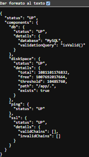
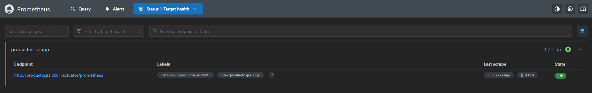
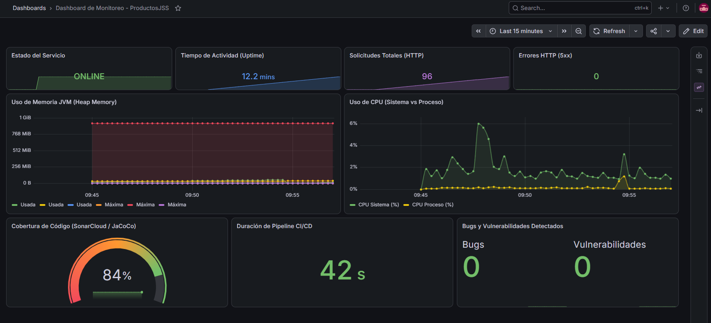
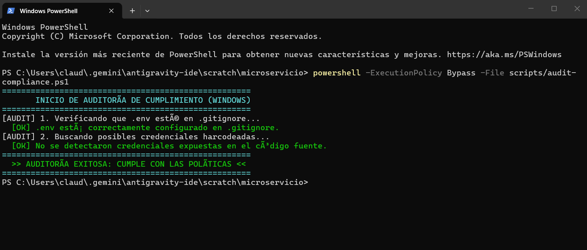

# Microservicio ProductosJSS

Este proyecto es un microservicio desarrollado con Spring Boot y Java 21 que permite gestionar productos, categorías, usuarios y órdenes de compra. Fue desarrollado como base para el trabajo de DevOps e incluye autenticación con JWT, documentación de API con Swagger, pruebas unitarias y un pipeline de CI/CD con GitHub Actions.

---

## Cómo levantar el proyecto localmente

Para correr el proyecto necesitas tener Docker Desktop instalado.

### Pasos

**1. Clonar el repositorio**

```bash
git clone https://github.com/reyessebastivn/microservicio.git
cd microservicio
```

**2. Crear el archivo de variables de entorno**

El proyecto usa un archivo `.env` para las credenciales. Hay una plantilla lista para copiar:

```bash
# En Linux/Mac:
cp .env.example .env

# En Windows (PowerShell):
Copy-Item .env.example .env
```

Los valores por defecto que vienen en `.env.example` funcionan para desarrollo local, no es necesario cambiarlos.

**3. Levantar el stack**

```bash
docker compose up --build
```

Esto levanta dos contenedores: la base de datos MySQL y la aplicación Spring Boot.

| Servicio | Dirección |
|----------|-----------|
| API REST | http://localhost:8081 |
| Swagger UI | http://localhost:8081/swagger-ui.html |
| MySQL | localhost:3307 |

Para detener todo:

```bash
docker compose down
```

Si también quieres borrar los datos guardados en el volumen:

```bash
docker compose down -v
```

---

## Estructura del proyecto

```
microservicio/
├── .github/
│   ├── workflows/ci.yml      # Pipeline de GitHub Actions
│   └── dependabot.yml        # Actualizacion automatica de dependencias
├── .env.example              # Plantilla de variables de entorno
├── docker-compose.yml        # Orquestacion del stack
└── ProductosJSS/
    ├── Dockerfile            # Imagen del microservicio
    ├── pom.xml               # Dependencias Maven
    └── src/
        ├── main/java/        # Codigo fuente
        └── test/java/        # Pruebas unitarias
```

El `docker-compose.yml` incluye redes personalizadas, volúmenes persistentes, variables de entorno, healthchecks y dependencias entre servicios.

---

## Pipeline CI/CD

El pipeline se ejecuta automáticamente con cada push o pull request a `main` y está dividido en 3 etapas que corren en orden:

### Etapa 1: Build, pruebas y análisis de seguridad

- Se compila el proyecto y se ejecutan las pruebas unitarias con JUnit
- Se genera el reporte de cobertura con JaCoCo
- Se hace análisis estático del código con SpotBugs (SAST) — bloquea si encuentra bugs de severidad alta
- Se escanean las dependencias con Snyk (SCA) — bloquea si encuentra vulnerabilidades altas
- Se hace un análisis adicional con OWASP Dependency Check
- Se empaqueta el `.jar` y se guarda como artefacto

### Etapa 2: Construcción de imagen Docker

- Descarga el `.jar` de la etapa anterior
- Construye la imagen Docker usando el Dockerfile del proyecto
- Verifica que la imagen fue creada correctamente

### Etapa 3: Despliegue en entorno simulado (solo en push a main)

- Crea el archivo `.env` desde los secrets configurados en GitHub
- Levanta el stack completo con `docker compose up --build -d`
- Hace un health check para confirmar que la app responde correctamente
- Muestra los logs y baja el stack al terminar

### Cómo garantizamos la trazabilidad y calidad

Cada ejecución del pipeline queda registrada en GitHub Actions vinculada al commit exacto que la disparó. Cualquier cambio en el código pasa obligatoriamente por pruebas, análisis de seguridad y construcción de imagen antes de llegar al despliegue. Si alguna de las etapas falla, las siguientes no se ejecutan.

Las herramientas de seguridad (Snyk y SpotBugs) están configuradas para bloquear el pipeline cuando detectan problemas de severidad alta, evitando que código vulnerable llegue al despliegue. Además, Dependabot revisa semanalmente las dependencias del proyecto y abre pull requests automáticos cuando hay actualizaciones disponibles.

### Secrets necesarios en GitHub

Para que el pipeline funcione hay que configurar estos secrets en **Settings → Secrets and variables → Actions**:

| Secret | Para qué sirve |
|--------|----------------|
| `SNYK_TOKEN` | Token de Snyk (se obtiene gratis en app.snyk.io) |
| `MYSQL_ROOT_PASSWORD` | Contraseña de MySQL para el entorno de CI |
| `MYSQL_DATABASE` | Nombre de la base de datos |
| `JWT_SECRET` | Clave para firmar los tokens JWT |

---

## Pruebas unitarias

Las pruebas están en `src/test/java/` y cubren los servicios principales de la aplicación:

- `ProductoServiceTest`
- `CategoriaServiceTest`
- `UsuarioServiceTest`

Para ejecutarlas localmente:

```bash
cd ProductosJSS
mvn clean test
```

---

## Seguridad

- La autenticación usa tokens JWT firmados con una clave secreta
- Las contraseñas se almacenan hasheadas con BCrypt
- Las dependencias se escanean automáticamente en cada ejecución del pipeline

---

## Flujo de trabajo con Git (GitFlow)

Se usó GitFlow como estrategia de ramas:

- `main` → versión estable
- `develop` → integración de cambios
- `feature/*` → nuevas funcionalidades
- `hotfix/*` → correcciones urgentes

---

## Variables de entorno

| Variable | Descripción |
|----------|-------------|
| `MYSQL_ROOT_PASSWORD` | Contraseña de MySQL |
| `MYSQL_ROOT_USERNAME` | Usuario de MySQL (default: root) |
| `MYSQL_DATABASE` | Nombre de la base de datos (default: basejoyas) |
| `JWT_SECRET` | Clave secreta para JWT |

---

## Entrega Final: Monitoreo, Calidad de Código, Despliegue en Kubernetes y DevOps

Este apartado detalla la integración final de la infraestructura y el pipeline de CI/CD, abarcando observabilidad, cumplimiento técnico, análisis estático, seguridad y el flujo de despliegue seguro.

---

### 1. Arquitectura de Monitoreo (Prometheus, Grafana y Pushgateway)

Hemos configurado un stack de monitoreo autocontenido y orquestado mediante Docker Compose para visualizar el estado del microservicio y los resultados del pipeline de CI/CD en tiempo real:

* **Spring Boot Actuator:** El microservicio exporta métricas a través del endpoint `/actuator/prometheus` usando Micrometer.
* **Prometheus:** Recolecta métricas de la aplicación cada 15 segundos y además recibe métricas del pipeline enviadas a través de Pushgateway.
* **Pushgateway:** Actúa como punto de recepción para trabajos efímeros (como las ejecuciones de GitHub Actions), permitiendo registrar métricas del ciclo de vida del software.
* **Grafana:** Visualiza toda la información en un panel interactivo preconfigurado, conectado a Prometheus como origen de datos.

#### Métricas clave del Dashboard:
* **Uso de Recursos (CPU y Memoria JVM):** Permite detectar fugas de memoria o saturación del procesador.
* **Tasa de Errores HTTP (2xx, 4xx, 5xx) y Rendimiento (Throughput):** Monitorea la estabilidad de los endpoints y el volumen de tráfico.
* **Métricas de CI/CD y Calidad de Código (Gauges en Vivo):** 
  - **Cobertura de Código (cicd_sonar_coverage):** Muestra el porcentaje de líneas cubiertas por pruebas unitarias (obtenido del reporte de JaCoCo en el pipeline).
  - **Duración del Pipeline (cicd_build_duration_seconds):** Registra el tiempo exacto que tardó el build y testeo en GitHub Actions.
  - **Estado del Pipeline y Hallazgos:** Registra si la ejecución fue exitosa y los bugs/vulnerabilidades detectados.

---

### 2. Políticas de Seguridad, Calidad y Puertas de Enlace (Quality Gates)

Para asegurar la robustez del código y evitar despliegues inseguros, se implementan controles automatizados en el pipeline de CI/CD:

1. **Auditoría de Cumplimiento Técnico (`audit-compliance.sh`):**
   - Valida la higiene de Git (que el archivo `.env` esté debidamente ignorado en `.gitignore`) y realiza un escaneo de secretos buscando posibles credenciales hardcodeadas en código fuente.
2. **Análisis de Vulnerabilidades (Snyk - SCA):**
   - Escanea las dependencias del proyecto. Si detecta librerías con vulnerabilidades de severidad alta, el pipeline se detiene inmediatamente. Se ejecuta de manera condicional asegurando que opere como gate bloqueante.
3. **Análisis estático de seguridad (SpotBugs - SAST):**
   - Analiza el código en busca de bugs de seguridad. Está configurado para interrumpir el build (`failOnError=true` en umbral High) ante fallos críticos.
4. **Análisis de Calidad Estática y Quality Gate (SonarCloud):**
   - Integrado en el pipeline con el parámetro `-Dsonar.qualitygate.wait=true`. Esto obliga al pipeline a esperar los resultados de SonarCloud y abortar el flujo de despliegue si el proyecto no supera los límites de calidad establecidos (cobertura, código duplicado o bugs).

---

### 3. Práctica de Despliegue Seguro en Kubernetes e Istio

El pipeline de despliegue continuo simula un entorno de producción seguro utilizando tecnologías cloud-native:

* **Kubernetes (Orquestación):**
  - Manifiestos listos en la carpeta `k8s/` que declaran un deployment (`deployment.yaml`) para la aplicación con 2 réplicas, un despliegue de base de datos (`db-deployment.yaml`), configmaps y secrets cifrados para separar la configuración del código.
  - Incluye probes de disponibilidad (`readinessProbe`) y salud (`livenessProbe`) que apuntan a Spring Boot Actuator para autorizar el tráfico de red solo a instancias completamente inicializadas.
* **Istio (Redes y Malla de Servicios):**
  - Declaración de reglas de Istio (`istio.yaml`) mediante componentes como `Gateway` (para control de tráfico de entrada por puerto 80), `VirtualService` (para enrutamiento dinámico hacia el servicio interno) y `DestinationRule` (para balanceo de carga round-robin).
* **AWS CloudWatch (Métricas Cloud):**
  - Integración nativa a través del paquete `micrometer-registry-cloudwatch2`. Las propiedades están configuradas de forma condicional para activarse únicamente en producción, evitando errores de inicialización en desarrollo local.
* **Pruebas de Aceptación como Gate de Producción (`acceptance-tests.sh`):**
  - Script que simula la interacción del usuario realizando llamadas automatizadas a endpoints públicos y de diagnóstico en el clúster desplegado. Si alguna de estas pruebas falla, el despliegue es rechazado.
* **Políticas de Aprobación en GitHub (Environments):**
  - El deployment está mapeado al entorno `production` en GitHub, lo que requiere aprobaciones y revisiones manuales obligatorias por parte de los administradores antes de proceder con la ejecución del job de despliegue en Kubernetes.

---

### 4. Instrucciones para Ejecución Local y Simulación en CI/CD

#### Levantar el Entorno de Monitoreo Local:
1. Copiar `.env.example` a `.env` y configurar los valores.
2. Iniciar el stack completo:
   ```bash
   docker compose up --build -d
   ```
3. Acceso a las interfaces:
   - **Microservicio:** http://localhost:8081
   - **Prometheus:** http://localhost:9090
   - **Pushgateway:** http://localhost:9091
   - **Grafana Dashboard:** http://localhost:3000 (Credenciales: `admin`/`admin`).

#### Simulación del Flujo de CI/CD Completo (KinD):
El clúster de Kubernetes se crea automáticamente en el runner de GitHub Actions utilizando **KinD (Kubernetes in Docker)**. Este flujo levanta el stack de monitoreo, despliega los recursos de Kubernetes e Istio, realiza las pruebas de aceptación y notifica el resultado al Pushgateway de forma transparente.

---

### 5. Evidencias de Ejecución Local e Integración

#### Observabilidad y Monitoreo

##### Consola de Prometheus (Scrape Targets en estado UP)
Evidencia que Prometheus se conecta exitosamente al microservicio Spring Boot y al Pushgateway de CI/CD.


##### Respuestas y Métricas Crudas (Actuator)
Demostración de los endpoints de salud y métricas de Spring Boot.
* **Salud del Microservicio (`/actuator/health`):**
  
* **Feed de Métricas en Formato Prometheus (`/actuator/prometheus`):**
  

##### Consumo y Rendimiento en Tiempo Real (Grafana con métricas de CI/CD)
Visualización gráfica de las métricas recolectadas del sistema y las estadísticas reales del pipeline de CI/CD en tiempo real.


#### Políticas de Cumplimiento Técnico

##### Script de Auditoría de Seguridad Local (PowerShell)
Demostración de la validación del repositorio local previa a un push.



